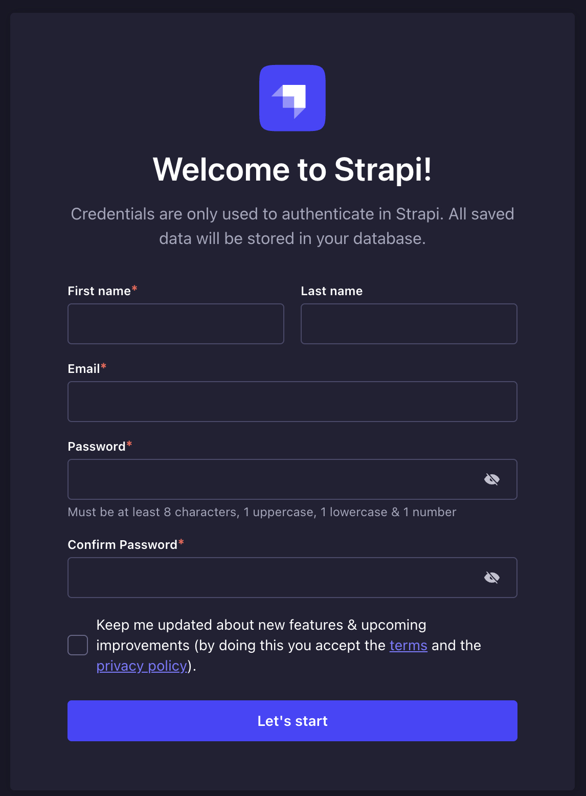
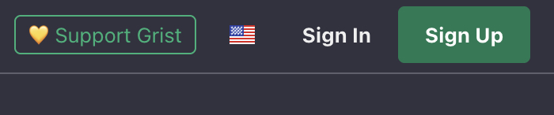
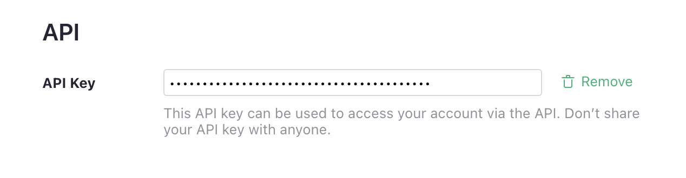
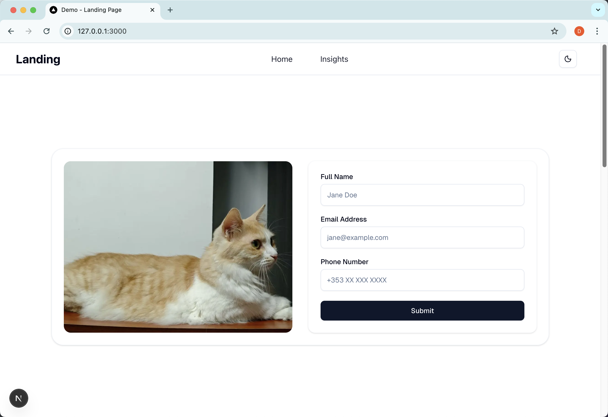
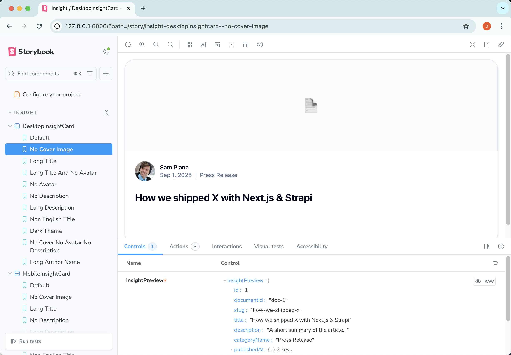

# landing-page-demo

This project is a demo of building responsive landing page

## Project Architecture Overview

This is a modern full-stack application with a clear separation of concerns:

### Project Structure

```shell

```

## Tech Stack

### Frontend Technologies

- **Framework**: [Next.js 15.5.3](https://nextjs.org/) with App Router
- **Language**: [TypeScript](https://www.typescriptlang.org/) (strict mode enabled)
- **Styling**: [Tailwind CSS v4](https://tailwindcss.com/) with modern utilities
- **UI Components**: [shadcn/ui](https://ui.shadcn.com/) built on Radix UI primitives
- **Forms**: Server Actions with [Zod](https://zod.dev/) validation

### Backend Technologies

- **CMS**: Strapi v5 headless content management
- **Database**: Grist for form data storage
- **Authentication**: JWT-based authentication system
- **API**: REST API by Strapi

### Development & Quality Tools

- **Storybook**: UI development tool to build and test reusable components
- **Linting**: ESLint with Next.js and TypeScript configurations
- **Code Quality**: TypeScript strict mode for enhanced type safety
- **Error Handling**: Centralized error management with boundaries
- **State Management**: React Server Components with server state


## Deployment Process

The project runs locally using **Node.js v20.13.1** and **Docker**.
It consists of three main parts: **Strapi CMS**, **Grist**, and **Next.js (with Storybook)**.

### Strapi CMS

#### Install Dependencies

Navigate to `/landing-page-demo/landing-page-backend` and install dependencies:

```
npm install
npm run develop
```

Once Strapi starts, you should see:

```
Welcome back!
To access the server ⚡️, go to:
http://localhost:1337
```

You will see the initial setup screen in the browser:



#### Importing Sample Data

Stop the Strapi process, then import the testing database:

```shell
cp ./backup/data.db ./.tmp/data.db
```

If you are on Windows environment, you can manually create `.tmp` folder and copy `data.db` from the `backup` folder into it.

Restart Strapi:

```shell
npm run develop
```

Access `http://127.0.0.1:1337` and log in with:

```shell
Username: test@test.com
Password: Landing-page-2025
```

You will then see the Strapi CMS interface with preloaded schema and data.

#### Why not use Strapi import/export?

Strapi’s official import/export method (https://docs.strapi.io/cms/data-management/import) is currently broken:

```shell
npm run strapi import -- -f /backup/landing-page-data-export.tar

> landing-page-backend@0.1.0 strapi
> strapi import -f /backup/landing-page-data-export.tar

? The import will delete your existing data! Are you sure you want to proceed? Yes
[2025-09-17 08:52:03.885] error: [FATAL] File '/backup/landing-page-data-export.tar' is not a valid Strapi data file.
Import process failed.
```

As a workaround, this project uses a **direct copy of the SQLite database** (`data.db`) for backup and restore in development.


### Grist

Install Docker

Grist runs via Docker. Navigate to `/landing-page-demo/landing-page-grist`:

```shell
docker pull gristlabs/grist

docker run -d --name=grist -p 8484:8484 -v $PWD/persist:/persist -it gristlabs/grist
```

Access the portal at `http://127.0.0.1:8484/` and click **Sign In** (top right):

click `Sign In` on the upper right



You will see the default **Home** workspace.

Inside it, open the `Users` table and click **Raw Data** (bottom left) to confirm the **Table ID**.

The **Document ID** is shown in the URL after `/docs/`.

Generate an **API key** in Profile Settings (`http://127.0.0.1:8484/o/docs/account`) and save.



#### Environment Variables

Configure Grist in the Next.js frontend at `/landing-page-frontend/.env.development.local`:

```shell
# Grist self-hosted instance
GRIST_BASE_URL=http://127.0.0.1:8484

# API key from Profile Settings
GRIST_API_KEY=<local-api-key>

# Document identifier (from the Grist URL after /docs/)
GRIST_DOC_ID=dsfNgFftiM1A

# Table identifier (from Raw Data view)
GRIST_TABLE_ID=Users

```


### Nextjs & Storybook

#### Nextjs Frontend

Navigate to `/landing-page-demo/landing-page-frontend`:

```shell
> npm install

❯ npm run dev

> landing-page-frontend@0.1.0 dev
> next dev --turbopack

   ▲ Next.js 15.5.3 (Turbopack)
   - Local:        http://localhost:3000
   - Network:      http://192.168.0.181:3000
   - Environments: .env.development.local

 ✓ Starting...
```

Access `http://127.0.0.1:3000/` to view the landing page:




#### Storybook

Navigate to `/landing-page-demo/landing-page-frontend`:

After installing dependencies, run:

```shell
❯ npm run storybook

> landing-page-frontend@0.1.0 storybook
> storybook dev -p 6006

storybook v9.1.5
```

Access `http://127.0.0.1:6006` to access the Storybook UI and browse component stories:




## Address for Local Testing Environment

### Strapi CMS

http://127.0.0.1:1337

### OpenAPI Documentation

http://127.0.0.1:1337/documentation/v1.0.0

### Landing Page (Nextjs Homepage)

http://127.0.0.1:3000/

### Storybook

http://127.0.0.1:6006

## Architecture

### Grist

#### Table Structure

Inside the Grist document (`landing`), a table named **Users** is created with the following fields:

| Field      | Type | Notes                               |
| ---------- | ---- | ----------------------------------- |
| `fullName` | Text | User’s full legal or preferred name |
| `email`    | Text | User’s email address                |
| `phone`    | Text | Optional phone number               |

#### API Usage & Data Flow

Form submissions from the Next.js frontend are sent to the backend route handler (`/api/form/submit`). 

The handler calls the Grist API:

**Endpoint**

```
POST {GRIST_BASE_URL}/api/docs/{GRIST_DOC_ID}/tables/{GRIST_TABLE_ID}/records
```

**Request body example**

```json
{
  "records": [
    {
      "fields": {
        "fullName": "Jane Doe",
        "email": "jane@example.com",
        "phone": "+353852048444"
      }
    }
  ]
}
```

**Response example**

```json
{
  "records": [
    {
      "id": 1,
      "fields": {
        "fullName": "Jane Doe",
        "email": "jane@example.com",
        "phone": "+353850000000"
      }
    }
  ]
}
```

1. **User fills form** on the landing page (`Hero` component → `LeadForm`).
2. **Next.js API route** (`/api/form/submit`) validates input with `zod`.
3. **Server-side fetch** sends the record to Grist via REST API.
4. **Grist stores** the new record in the **Users** table.
5. **Response returned** to frontend. Success or error notification shown with Sonner.


## Reference

- Storybook: https://storybook.js.org/
- Grist: https://github.com/gristlabs/grist-core
- Next.js: https://nextjs.org/docs
- Shadcn UI Landing Page Template: https://github.com/akash3444/shadcn-ui-landing-page/tree/tailwind-v4
