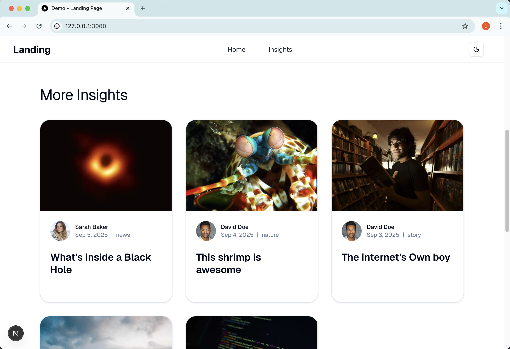

# landing-page-demo

This project is a **demo of building a responsive landing page** with a modern full-stack architecture, integrating **Next.js**, **Strapi CMS**, and **Grist**.

---

## Prerequisites

- **Node.js** v20.13.1 (works with Node.js 20.x – 22.x)
- **npm** package manager
- **Docker** (required for Grist)

---

## Project Architecture Overview

This is a modern full-stack application with a clear separation of concerns:

- **Frontend**: Next.js 15 with Tailwind CSS and shadcn/ui
- **Backend CMS**: Strapi v5 for content schema & article management
- **Database**: SQLite (bundled with Strapi) & Grist (relational spreadsheet-database)
- **UI Dev & Testing**: Storybook for component previews and visual testing

---

### Project Structure

```shell
landing-page-demo/
├── landing-page-frontend/   # Next.js 15 frontend (Tailwind v4, shadcn/ui, Storybook)
├── landing-page-backend/    # Strapi CMS backend with sample schema & content
├── landing-page-grist/      # Docker-ready Grist instance
└── README.assets/           # Screenshots & documentation images
└── README.md                # Detailed technical design & local deployment notes
```

---

## Tech Stack

### Frontend

- **Framework**: [Next.js 15.5.3](https://nextjs.org/) with App Router
- **Language**: [TypeScript](https://www.typescriptlang.org/) (strict mode enabled)
- **Styling**: [Tailwind CSS v4](https://tailwindcss.com/) with modern utilities
- **UI Components**: [shadcn/ui](https://ui.shadcn.com/) built on Radix UI primitives
- **Forms**: react-hook-form + [Zod](https://zod.dev/)
- **State Management**: React Server Components (RSC)

### Backend

- **CMS**: Strapi v5 headless content management
- **Database**: SQLite & Grist (relational spreadsheet-database)
- **API**: REST API exposed by Strapi

### Development & Quality Tools

- **Storybook**: UI development tool to build and test reusable components
- **Linting**: ESLint with Next.js and TypeScript configurations
- **Code Quality**: TypeScript strict mode for enhanced type safety

## Environment Variables

### Frontend (`/landing-page-frontend/.env.development.local`)

```shell
NEXT_PUBLIC_STRAPI_URL=http://127.0.0.1:1337
GRIST_BASE_URL=http://127.0.0.1:8484
GRIST_API_KEY=<local-api-key>
GRIST_DOC_ID="dsfNgFftiM1A"
GRIST_TABLE_ID="Users"
```

### Backend (`/landing-page-backend/.env`)

```shell
APP_KEYS=...
API_TOKEN_SALT=...
JWT_SECRET=...
DATABASE_CLIENT=sqlite
DATABASE_FILENAME=.tmp/data.db
...
```

---

## Deployment Process

The project runs locally using **Node.js v20.13.1** and **Docker**.
It consists of three main parts: **Strapi CMS**, **Grist**, and **Next.js (with Storybook)**.

### Strapi CMS

#### Install Dependencies

Navigate to `/landing-page-demo/landing-page-backend` and install dependencies:

```
npm install
npm run develop
```

Once Strapi starts, you should see:

```
Welcome back!
To access the server ⚡️, go to:
http://localhost:1337
```

You will see the initial setup screen in the browser:


#### Importing Sample Data

Stop the Strapi process, then import the testing database:

```shell
cp ./backup/data.db ./.tmp/data.db
```

If you are on Windows environment, you can manually create `.tmp` folder and copy `data.db` from the `backup` folder into it.

Restart Strapi:

```shell
npm run develop
```

Access `http://127.0.0.1:1337` and log in with:

```shell
Username: test@test.com
Password: Landing-page-2025
```

You will then see the Strapi CMS interface.

#### Importing Public Assets

In addition to the database backup, sample **media assets** are stored in `backup/public.zip`.
These need to be extracted into the Strapi's `public` folder so that images and uploads are available.

Navigate to backend folder:

```bash
cd landing-page-demo/landing-page-backend
```

**Unzip the backup** into the `public/` folder, overwriting existing files:

```bash
unzip -o ../backup/public.zip -d ./public
```

On Windows (PowerShell), you can use:

```powershell
Expand-Archive -Force ../backup/public.zip ./public
```

Then restart Strapi

```bash
npm run develop
```

You can verify by checking the Strapi's Media Library:

`http://127.0.0.1:1337/admin/plugins/upload`

#### Configure Public API Permissions

By default, Strapi restricts unauthenticated access to API routes. To allow the frontend to fetch **Insights(Articles)** and the **Cover**, you need to update the **Public** role:

1. In the Strapi Admin Panel, go to:
    **Settings → Users & Permissions Plugin → Roles → Public**
2. Scroll through the list of available permissions.
3. Enable the following:
   - **Article** content type
     - `find` (GET list of articles)
     -  `findOne` (GET single article by ID)
   - **Cover** content type
     - `find` (GET list of covers)
4. Save the changes.

Now the frontend (Next.js) can successfully call Strapi’s `/api/articles` and `/api/cover` endpoints.

#### Troubleshooting: HTTP status code 426 on Port 1337

If you encounter an HTTP error like:

```
426 Upgrade Required
```

it usually means that Strapi's **default port 1337 is already occupied**.

- On **Windows**, port `1337` is often blocked by background services such as **Razer products (e.g., `RzSDKServer`)**, which keep the port in use.
- Reference: [Strapi issue #12414](https://github.com/strapi/strapi/issues/12414)

**Solution:**

1. Check which process is using port 1337.

   - On Linux/macOS:

     ```shell
     lsof -i:1337
     ```

   - On Windows PowerShell:

     ```shell
     netstat -ano | findstr :1337
     ```

2. Kill the conflicting process (or stop the Razer service).

3. Restart Strapi with:

   ```
   npm run develop
   ```

If the port remains unavailable, you can also run Strapi on a different port in `landing-page-backend/.env`:

```shell
PORT=1338
```

#### Why not use Strapi import/export?

Strapi’s official import/export method (https://docs.strapi.io/cms/data-management/import) is currently broken:

```shell
npm run strapi import -- -f /backup/landing-page-data-export.tar

> landing-page-backend@0.1.0 strapi
> strapi import -f /backup/landing-page-data-export.tar

? The import will delete your existing data! Are you sure you want to proceed? Yes
[2025-09-17 08:52:03.885] error: [FATAL] File '/backup/landing-page-data-export.tar' is not a valid Strapi data file.
Import process failed.
```

As a workaround, this project uses a **direct copy of the SQLite database** (`data.db`) and **resource public folder** for backup and restore in development.

### Grist

Grist runs via Docker from `/landing-page-demo/landing-page-grist`, use the `${PWD}` form so it works in Linux/macOS shells and Windows PowerShell.

#### Pull image

```bash
docker pull gristlabs/grist
```

#### Run container (Linux/macOS **or** Windows PowerShell)

```bash
docker run -d --name=grist -p 8484:8484 -v ${PWD}/persist:/persist -it gristlabs/grist
```

Notes:

- `${PWD}` resolves to the current directory in **bash/zsh** and **PowerShell**.
- On **Linux/macOS and Windows**, the `${PWD}` value may resolve differently depending on whether you run the command inside the `landing-page-grist` folder or from the root project folder. Please **confirm the actual host path** of the mounted `persist/` directory yourself, and make sure to unpack the backup (`grist-persist.zip`) into that exact folder so the container can read it correctly.

#### Unpack `grist-persist.zip` to the host `persist/` folder

Overwrite the mounted `persist` directory with decompressed `grist-persist.zip`

**Linux/macOS**

```shell
# From /landing-page-demo/landing-page-grist
unzip -o ../backup/grist-persist.zip -d ./persist
```

**Windows PowerShell**

```shell
# From /landing-page-demo/landing-page-grist
Expand-Archive -Force ../backup/grist-persist.zip ./persist
```

If the container is already running, you can keep it running. Docker bind mounts reflect changes instantly. If you prefer, you can stop it first:

```shell
docker stop grist
# unpack files...
docker start grist
```

#### Launch & access

If you haven’t started the container yet, start it:

```bash
docker start grist
```

Open Grist at:

```bash
http://127.0.0.1:8484/
```

Access the portal at `http://127.0.0.1:8484/` and click **Sign In** (top right):

click `Sign In` on the upper right


You will see the default **Home** workspace.

Inside it, open the `Users` table and click **Raw Data** (bottom left) to confirm the **Table ID**.

The **Document ID** is shown in the URL after `/docs/`.

Generate and copy the **API key** in Profile Settings (`http://127.0.0.1:8484/o/docs/account`) and save.


#### Environment Variables

Configure Grist in the Next.js frontend at `/landing-page-frontend/.env.development.local`:

```shell
# Grist self-hosted instance
GRIST_BASE_URL=http://127.0.0.1:8484

# API key from Profile Settings
GRIST_API_KEY=<local-api-key>

# Document identifier (from the Grist URL after /docs/)
GRIST_DOC_ID=dsfNgFftiM1A

# Table identifier (from Raw Data view)
GRIST_TABLE_ID=Users

```


### Nextjs & Storybook

#### Nextjs Frontend

Navigate to `/landing-page-demo/landing-page-frontend`:

```shell
> npm install

❯ npm run dev

> landing-page-frontend@0.1.0 dev
> next dev --turbopack

   ▲ Next.js 15.5.3 (Turbopack)
   - Local:        http://localhost:3000
   - Network:      http://192.168.0.181:3000
   - Environments: .env.development.local

 ✓ Starting...
```

Access `http://127.0.0.1:3000/` to view the landing page:




#### Storybook

Navigate to `/landing-page-demo/landing-page-frontend`:

After installing dependencies, run:

```shell
❯ npm run storybook

> landing-page-frontend@0.1.0 storybook
> storybook dev -p 6006

storybook v9.1.5
```

Access `http://127.0.0.1:6006` to access the Storybook UI and browse component stories:


## Address for Local Testing Environment

### Strapi CMS

http://127.0.0.1:1337

### OpenAPI Documentation

http://127.0.0.1:1337/documentation/v1.0.0

### Landing Page (Nextjs Homepage)

http://127.0.0.1:3000/

### Storybook

http://127.0.0.1:6006

## Architecture

### Grist

#### Table Structure

Inside the Grist document (`landing`), a table named **Users** is created with the following fields:

| Field      | Type | Notes                               |
| ---------- | ---- | ----------------------------------- |
| `fullName` | Text | User’s full legal or preferred name |
| `email`    | Text | User’s email address                |
| `phone`    | Text | Optional phone number               |

#### Grist API Usage & Data Flow

1. **User fills form** on the landing page (`Hero` → `LeadForm`).
2. **Next.js API route** (`/api/form/submit`) validates input with `zod`.
3. **Server-side fetch** sends the record to Grist via REST API.
4. **Grist stores** the new record in the **Users** table.
5. **Response returned** to frontend → success/error notification via **Sonner**

**Endpoint**

```
POST {GRIST_BASE_URL}/api/docs/{GRIST_DOC_ID}/tables/{GRIST_TABLE_ID}/records
```

**Request body example**

```json
{
  "records": [
    {
      "fields": {
        "fullName": "Jane Doe",
        "email": "jane@example.com",
        "phone": "+353852048444"
      }
    }
  ]
}
```

**Response example**

```json
{
  "records": [
    {
      "id": 1,
      "fields": {
        "fullName": "Jane Doe",
        "email": "jane@example.com",
        "phone": "+353850000000"
      }
    }
  ]
}
```

---

## References

- [Next.js Documentation](https://nextjs.org/docs)
- [Strapi Documentation](https://docs.strapi.io/)
- [Grist Core](https://github.com/gristlabs/grist-core?utm_source=chatgpt.com)
- [Storybook](https://storybook.js.org/)
- [shadcn/ui Landing Page Template](https://github.com/akash3444/shadcn-ui-landing-page/tree/tailwind-v4)
